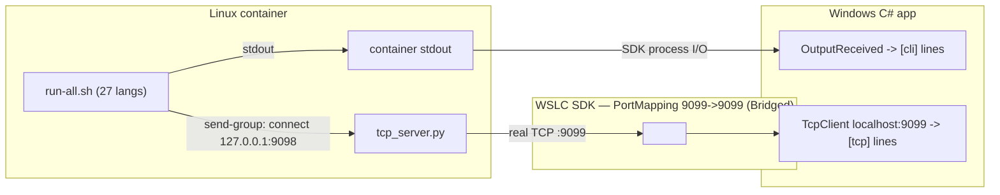

# WSLC Polyglot Hello — Real TCP Channel Design

**Date:** 2026-07-07
**Status:** Approved (design), pending spec review

## Goal

Add a **real TCP transport** to the existing `wslc-polyglot-hello` demo so that
each participating language's "hello world" message is genuinely sent over a TCP
socket from the container to the Windows app — not merely printed as a `[http]`
text label (the current behavior).

Topology (the only one that works under WSLC networking with no system changes /
no elevation — verified end-to-end): **the container is the TCP server, the
Windows C# app is the client.** Messages flow container → Windows over a real
socket, exposed via the SDK's `PortMappings` + `Bridged` networking.

The existing `[cli]` stdout channel is kept unchanged. The `[tcp]` lines are new
and travel over the real socket.

## Why this topology (verified constraints)

Probed on this machine (`wslc` 2.9.3), with real builds/runs:

- **Container → Windows host port is blocked by default.** In the WSLC network
  the container sits on `172.17.0.2/16` (gateway `172.17.0.1`); the Windows host
  interfaces (`10.172.204.184`, `172.28.160.1` …) are across the WSLC NAT + the
  WSL Hyper-V firewall. A container-initiated `connect` to any host port gets
  `Connection refused`. So "container is the client to a Windows server" does
  **not** work without changing host firewall / network mode. (`host.docker.internal`
  resolves but is unreachable inbound.)
- **`HttpListener` on a non-localhost address needs admin.** Binding `http://+`,
  `0.0.0.0`, or a specific host IP fails with `Access is denied` for a
  non-admin user (http.sys URL ACL). Ruled out a Windows-side HTTP server.
- **Host → container IS natively supported.** `NetworkingMode = Bridged` +
  `PortMappings` maps a container port to Windows `localhost` (the ROS demo used
  this). **Verified:** a container TCP server on `:9099`, mapped 9099→9099, was
  reached by a Windows `TcpClient` on `127.0.0.1:9099`, which received a line the
  container sent.
- **Buffered aggregator works and is timing-safe.** A container-side aggregator
  that accepts language senders on one port and the Windows downstream on
  another, **buffering lines until Windows connects**, was verified: a language
  that sent BEFORE the Windows client connected (12 s delay) still had its line
  delivered. Multiple language connections aggregated to the single Windows
  downstream correctly (3/3 lines received).

## Decisions (locked with user)

| Choice | Decision |
|---|---|
| Transport | Real TCP (not HTTP; the earlier HTTP idea was cancelled) |
| Topology | Container = TCP server, Windows C# app = client (via PortMappings) |
| How languages emit | **Each language opens its own TCP connection** to the in-container aggregator and sends its line |
| TCP failure semantics | **Hard-fail** — if a send-group language fails to send, `run-all.sh` aborts non-zero (consistent with the existing fail-fast) |
| Which languages send TCP | ~18 where a socket is straightforward (see table); the rest keep `[cli]` only |
| `[cli]` stdout channel | Unchanged — all 27 languages still print their `[cli]` line |
| Ports | container `9098` = language→aggregator; container `9099` = aggregator→Windows, mapped to Windows `localhost:9099` |

## Language groups

**Send-group (18) — emit `[cli]` (stdout) AND send `[tcp]` over a socket:**
python, javascript, ruby, php, perl, lua, r, go, rust, java, kotlin, dart,
julia, swift, typescript, c, c++, ocaml.

**Skip-group (9) — emit `[cli]` only (no TCP; raw sockets are painful/verbose):**
assembly, cobol, fortran, ada, prolog, lisp, zig, haskell, bash.

Rationale: a language is in the send-group when its standard library gives a
few-line TCP client. The skip-group are languages where a hand-written socket is
disproportionate for a demo (or needs extra libraries). The split is a
pragmatic, documented choice, not a language-capability claim.

## Architecture

```
Container start (init process = run-all.sh):
  1. Launch tcp_server.py in the background; wait until it is listening.
  2. Run the 27 languages in TIOBE order (existing behavior):
       - every language prints "hello world from [<lang>]" -> stdout -> [cli]
       - send-group languages ALSO connect to 127.0.0.1:9098 and send
         "hello world from [<lang>]\n"  (hard-fail on error)

tcp_server.py (in container):
  - listens 127.0.0.1:9098 for language senders; reads one line each; enqueues
  - listens 0.0.0.0:9099 for the Windows downstream; buffers the queue until
    Windows connects, then forwards every line to Windows

SDK (Program.cs):
  - ContainerSettings: NetworkingMode = Bridged,
    PortMappings = [ new(9099, 9099, PortProtocol.TCP) ]

Windows C# app (Program.cs):
  - unchanged: streams container stdout -> prints [cli]/[load]/[done] lines
  - NEW: background task -> TcpClient polls 127.0.0.1:9099 (retry until the
    container server is up) -> reads each line -> prints "[tcp] <line>"
  - waits for run-all.sh to exit (finite), then stops reading + tears down
```



## Per-language TCP send

Each send-group language connects to `127.0.0.1:9098`, writes exactly
`hello world from [<lang>]\n`, closes. The message content is identical to its
`[cli]` line. Exact snippets are finalized during implementation and **verified
by a real `wslc image build` + run** (the same de-risking used for the
toolchains). Representative approaches:

- python: `socket.create_connection(('127.0.0.1',9098)).sendall(b'...')`
- node (javascript / typescript): `net.connect(9098,'127.0.0.1',...)`
- ruby: `TCPSocket.open('127.0.0.1',9098){|s| s.write '...'}`
- go: `net.Dial("tcp","127.0.0.1:9098")`
- rust: `TcpStream::connect("127.0.0.1:9098")`
- java / kotlin: `Socket("127.0.0.1",9098).getOutputStream().write(...)`
- c / c++: BSD sockets (`socket/connect/write`)
- others (php, perl, lua, r, dart, julia, swift, ocaml): each language's stdlib
  TCP client.

If any send-group language cannot be made to send reliably during
implementation, it is moved to the skip-group and the README table updated —
rather than weakening hard-fail or faking it.

## run-all.sh contract (updated)

- `set -euo pipefail` retained (fail-fast / hard-fail).
- **New startup:** launch `tcp_server.py &`, then wait (poll) until port 9098 is
  accepting, with a bounded timeout; if the server never comes up, abort
  non-zero before running any language.
- For each language in TIOBE order: print `[cli]` line as today. For send-group
  languages, additionally run the language's send step. A non-zero send (or the
  language process failing) aborts the whole run (hard-fail), printing
  `run-all: FAILED at [<lang>] (tcp)` to stderr.
- The `[cli]` line is still produced by capturing the program's stdout and
  echoing it (unchanged mechanism).

## Windows app changes (Program.cs)

- Add to `ContainerSettings`: `NetworkingMode = ContainerNetworkingMode.Bridged`
  and `PortMappings = new List<ContainerPortMapping> { new(9099, 9099,
  PortProtocol.TCP) }`.
- After `container.Start()`, start a background `Task`: loop-connect a
  `TcpClient` to `127.0.0.1:9099` (the container server may not be up yet — retry
  with a short delay for up to ~30 s), then `StreamReader.ReadLineAsync()` in a
  loop, printing `[tcp] {line}` for each. Stop when the stream closes or the run
  completes.
- Main flow still waits on the init process `Exited` (finite run), then cancels
  the TCP reader and tears down (Stop/Delete/Terminate) as today.
- The `[cli]` streaming, fresh-session-store, and `EnableAutoRemove` behavior are
  unchanged.

## Error handling

- **TCP is hard-fail on the send side (container):** a send-group language that
  fails to connect/send aborts `run-all.sh` non-zero → the app surfaces the
  non-zero exit and cleans up. This matches the user's decision.
- **Windows TCP reader is best-effort on the receive side:** if the `TcpClient`
  can't connect within the retry window, the app logs it and still completes the
  `[cli]` run — the reader never blocks teardown. (The container-side hard-fail
  is the real correctness gate; the Windows reader just displays what arrives.)
- **Port already in use:** `tcp_server.py` uses `SO_REUSEADDR`; the fresh session
  per run plus `EnableAutoRemove` keep re-runs clean, as today.
- **Teardown:** unchanged best-effort Stop/Delete + session.Terminate in
  `finally`.

## Acceptance criteria

1. The app **compiles** (`dotnet build`).
2. The build still **produces `polyglot.tar`** (all 27 toolchains + the new
   `tcp_server.py` present; send-group source changes compile).
3. Running it prints, to the Windows console:
   - the **27 `[cli]` lines** in TIOBE order (unchanged), AND
   - the **18 `[tcp]` lines** from the send-group, received over the real TCP
     socket (container server → PortMapping → Windows `TcpClient`).
   Exit code 0.
4. **Hard-fail holds:** if a send-group language's TCP send fails, the run exits
   non-zero (demonstrated by the fail-fast path; not necessarily triggered in a
   normal run).
5. On exit the container + session are torn down; re-running does not error.

## Testing / verification

Hand-run demo. `wslc` 2.9.3 is installed and the full TCP path was verified
during design, so this is runnable here:

```
dotnet build test/demo/wslc-polyglot-hello/app/WslcPolyglotHello.csproj -c Debug   # criteria 1-2
dotnet run   --project test/demo/wslc-polyglot-hello/app/WslcPolyglotHello.csproj -c Debug  # criteria 3-5
```

Success signal: the console shows 27 `[cli]` lines and 18 `[tcp]` lines, and the
process exits 0. The `[tcp]` lines prove the real socket path end-to-end.

## Out of scope / non-goals

- No change to which languages exist (still 27) or their `[cli]` output.
- No Windows-side HTTP/TCP server (ruled out — admin/firewall constraints).
- No system network reconfiguration (Hyper-V firewall, mirrored mode).
- The `[http]` label is **replaced** by the real `[tcp]` channel; the demo no
  longer emits a fake `[http]` label. (If a `[http]`-labeled line is still
  desired as well, that is a separate follow-up.)

## README updates

- Explain the real TCP path (container server, PortMapping, Windows TcpClient)
  and that `[tcp]` is a genuine socket message, not a label.
- Group table: which languages send TCP vs `[cli]`-only, and why.
- Note the verified WSLC networking constraint (container→host inbound is
  blocked; host→container via PortMappings is the supported direction).
- Troubleshooting: `[tcp]` lines missing → the container server/port mapping;
  a language failing → hard-fail, read the `run-all: FAILED at [<lang>] (tcp)`.
