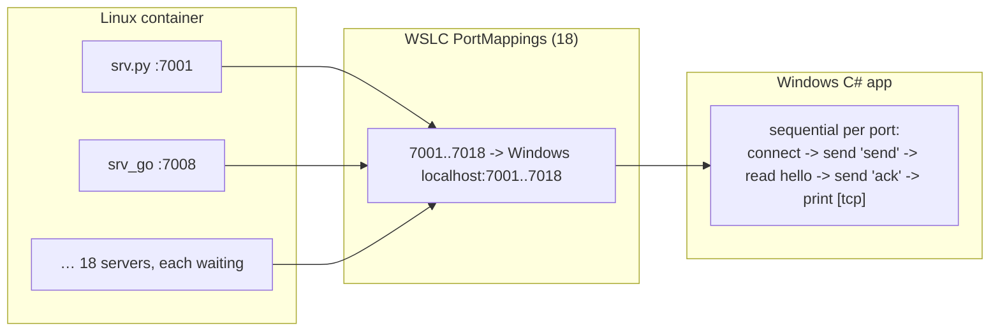

# WSLC Polyglot Hello — Per-Language TCP Servers Design

**Date:** 2026-07-08
**Status:** Approved (design), pending spec review

## Goal

Replace the current `[tcp]` aggregator design with a **per-language TCP server**
model: each of the 18 participating languages runs its **own** TCP server on its
**own** port, stays active waiting, and the Windows app connects to each in turn,
performs a request/response/ack handshake, and the language server then exits.

**Handshake (per language):**
```
Windows connects to the language's server (localhost:<port>)
  Windows → server:  "send\n"
  server  → Windows: "hello world from [<lang>]\n"
  Windows → server:  "ack\n"
  server exits
Windows app prints:  [tcp] hello world from [<lang>]
```

This matches the user's intent: each language's TCP directly connects with the
Windows side, the language waits for a message from Windows, replies, gets an
ack, then exits. The `[cli]` stdout channel (all 27 languages) is unchanged.

## Why this topology (verified)

The container must be the TCP server and Windows the client — **container→host
inbound is blocked in WSLC** (re-verified: a container `connect` to a Windows
host port gets `Connection refused`). Host→container via `PortMappings` is the
supported direction. So each language listens; Windows connects.

**Both technical prerequisites were verified end-to-end with real `wslc` builds
during design:**
- **Multiple simultaneous port mappings work.** A probe container ran two servers
  (ports 7001/7002), both mapped; a Windows `TcpClient` connected to each, sent a
  request, and received the expected `ack:<port>` reply. `MULTI-PORT PROBE: PASS`.
- **All 18 language servers work.** A probe built + ran all 18 servers (each on a
  distinct port) plus an in-container driver that did the request→hello→ack
  handshake against each. `RESULT: 18/18 ok; FAIL=[]` — including the hard ones
  (C, C++, Swift, OCaml). No language needs to fall back to `[cli]`-only.

## Decisions (locked with user)

| Choice | Decision |
|---|---|
| Model | Each language = its own TCP server on its own port (replaces the aggregator) |
| Relationship to current `[tcp]` | **Replaces** it — remove `tcp_server.py` + `senders/`, add `servers/` |
| Languages | All 18 (python, javascript, ruby, php, perl, lua, r, go, rust, java, kotlin, dart, julia, typescript, c, c++, ocaml, swift) — all verified |
| Handshake | Windows sends `send` first; language replies `hello world from [<lang>]`; Windows replies `ack`; language exits |
| Windows connect order | **Sequential** — connect to port 7001, handshake, then 7002, … 7018 |
| Server lifetime | All 18 start in the background at container start, wait; each exits after its ack |
| `[cli]` channel | Unchanged — all 27 languages still print `[cli]` |
| Failure semantics | **Hard-fail** — a server that fails to start / handshake makes run-all.sh exit non-zero |
| Ports | 7001–7018, fixed per language (table below) |

## Port assignment (fixed)

| Port | Lang | Port | Lang | Port | Lang |
|---|---|---|---|---|---|
| 7001 | python | 7007 | r | 7013 | julia |
| 7002 | javascript | 7008 | go | 7014 | typescript |
| 7003 | ruby | 7009 | rust | 7015 | c |
| 7004 | php | 7010 | java | 7016 | c++ |
| 7005 | perl | 7011 | kotlin | 7017 | ocaml |
| 7006 | lua | 7012 | dart | 7018 | swift |

The csproj declares 18 `PortMappings` (7001→7001 … 7018→7018, all TCP).

## Architecture

```
Container start (init = run-all.sh):
  1. Launch all 18 language servers in the background, each `bind`+`listen` on
     its port and blocking on `accept` (active, waiting).
  2. Run the 27 languages' [cli] lines in TIOBE order (unchanged).
  3. `wait` for all 18 servers to exit (each exits after its ack), so the
     container stays alive until every handshake is done.

Each language server (servers/srv.<ext>, verified):
  bind 0.0.0.0:<port>; listen; accept;
  recv(request); send "hello world from [<lang>]\n"; recv(ack); close/exit.

SDK (Program.cs):
  ContainerSettings.NetworkingMode = Bridged
  PortMappings = [ new(7001,7001,TCP), ..., new(7018,7018,TCP) ]   # 18 entries

Windows app (Program.cs):
  - unchanged: streams container stdout -> [cli] lines
  - NEW: after Start(), SEQUENTIALLY for each (lang,port) in 7001..7018:
      retry-connect TcpClient to 127.0.0.1:<port> (the mapping is slow / the
      WSLC proxy may accept+close early — retry until the handshake succeeds);
      send "send\n"; read a line (the hello); send "ack\n"; print "[tcp] <hello>".
  - waits for run-all.sh to exit (finite), then tears down.
```



## The 18 language servers (verified)

Each `servers/srv.<ext>` takes the port as its first CLI argument, binds
`0.0.0.0:<port>`, accepts one connection, reads the request, sends
`hello world from [<lang>]\n`, reads the ack, closes/exits. The exact source for
all 18 (validated by the 18/18 probe) is carried into the implementation plan
verbatim. Compiled servers (c, c++, rust, go, ocaml, kotlin→jar, java→class,
typescript→js, dart→exe) are built at image-build time into `servers/bin/`;
interpreted servers (python, node js, ruby, php, perl, lua, r, julia,
swift-interpreted) run from source.

## run-all.sh contract (updated)

- `set -euo pipefail` retained (hard-fail).
- **Startup:** launch all 18 servers in the background (`srv & … & `), capturing
  each PID. Bounded readiness is implicit — the servers bind immediately;
  Windows retries the connect.
- Run the 27 languages' `[cli]` lines in TIOBE order (unchanged `cli` helper).
- **End:** `wait` for the 18 server PIDs. Each server exits after its ack, so
  `wait` returns once all handshakes are done. If a server exits non-zero (crash,
  bind failure), hard-fail: `run-all.sh` returns non-zero (`run-all: FAILED:
  server [<lang>] exited non-zero`), which the app surfaces.
- An overall safety timeout wraps the `wait` so a never-connected server can't
  hang the container forever (bounded, e.g. via `timeout` around the wait or a
  per-server accept timeout in the server — the plan picks the concrete
  mechanism).

## Windows app changes (Program.cs)

- Add 18 `PortMappings` + `NetworkingMode = Bridged` to `ContainerSettings`.
- After `container.Start()`, run a **sequential** handshake loop over the fixed
  `(lang, port)` list 7001..7018. For each: retry-connect a `TcpClient` to
  `127.0.0.1:<port>` within a per-port window (the mapping needs ~30–55 s to
  activate and the WSLC proxy may accept+immediately-close before the in-container
  server is reachable — so retry until a **full handshake** completes, not just a
  connect); write `send\n`; `ReadLineAsync` the hello; write `ack\n`; print
  `[tcp] <hello>`.
- Main flow still waits on the init process `Exited`, then tears down. The
  handshake loop runs before/while the container is alive; because it's
  sequential and each server waits, ordering is deterministic.
- `[cli]` streaming, fresh-session-store, `EnableAutoRemove`, teardown unchanged.

## Error handling

- **Hard-fail (container side):** a server failing to start or exiting non-zero
  aborts `run-all.sh` non-zero → app surfaces the non-zero exit + cleans up.
- **Windows handshake:** each port is retried until the handshake completes or a
  per-port deadline elapses. If a port never completes, that's a real failure —
  the corresponding server also won't have exited cleanly, so run-all.sh's `wait`
  + hard-fail is the correctness gate; the Windows side logs which port failed.
- **Teardown:** unchanged best-effort Stop/Delete + session.Terminate; fresh
  session store + `EnableAutoRemove` keep re-runs clean.

## Acceptance criteria

1. The app **compiles** (`dotnet build`).
2. The build **produces `polyglot.tar`** (27 toolchains + the 18 servers; the 9
   compiled servers compile).
3. Running it prints **27 `[cli]` lines** (unchanged) AND **18 `[tcp]` lines**,
   each obtained via the per-language server handshake (connect → send → hello →
   ack) over its own mapped port, exit code 0.
4. **Hard-fail:** a server failing makes the run exit non-zero.
5. On exit the container + session are torn down; re-running does not error.

## Testing / verification

Hand-run demo; `wslc` 2.9.3 installed and both prerequisites verified, so it's
runnable here:
```
dotnet build test/demo/wslc-polyglot-hello/app/WslcPolyglotHello.csproj -c Debug   # criteria 1-2
dotnet run   --project test/demo/wslc-polyglot-hello/app/WslcPolyglotHello.csproj -c Debug  # criteria 3-5
```
Success: 27 `[cli]` + 18 `[tcp]` lines, exit 0. Each `[tcp]` line is the result
of a real per-language-server handshake over a distinct mapped port.

**Honest performance note:** 18 port mappings each take ~30–55 s to activate, and
Windows connects sequentially, so a full run can take **several minutes** (longer
than the single-port aggregator version). This is inherent to the per-port model.

## Out of scope / non-goals

- No change to the 27 languages or their `[cli]` output.
- No Windows-side server (container→host inbound is blocked; ruled out).
- The aggregator (`tcp_server.py`) and the one-shot senders (`senders/`) are
  **removed** — this design supersedes them.

## README updates

- Replace the aggregator description with the per-language-server model:
  each language its own server + port, Windows connects sequentially and does the
  send/hello/ack handshake, `[tcp]` printed per language.
- Port table; the handshake protocol; the sequential-connect + ~30–55 s×N timing
  caveat (run takes several minutes).
- Keep the topology rationale (container=server because inbound is blocked) and
  the wslc stale-build-context workaround.
